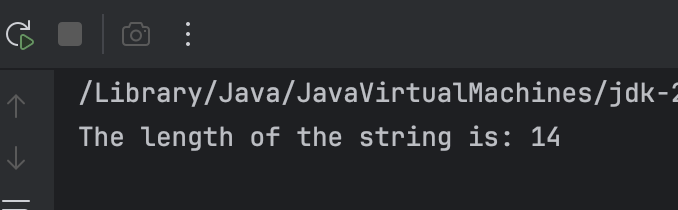
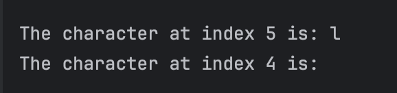
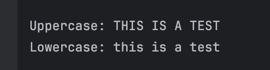
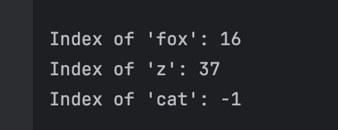
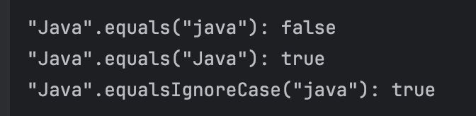
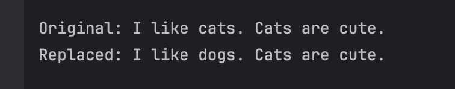
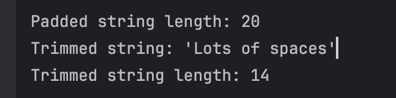

# JC-Exploring-Java-String-Methods

**Name:** Andre Dominic Ha Lacra

---

## Output Screenshots and Explanations per Exercise

---

### Exercise 1: `length()` – Finding the String's Size

**Prediction**  
Based on the readings, `length()` returns all characters in a string, including white spaces.  
For example, the string `greeting` has 14 characters in total, so `greeting.length()` will return `14`.

**Observation**  
The actual output:
```
The length of the string is: 14
```

**Output Screenshot:**  


---

### Exercise 2: `charAt()` – Accessing a Character

**Prediction**  
`charAt(index)` returns the character at the given index (starting from 0).  
For example, index `5` in the string will return `'l'`. If index is `4`, it will return a space `' '`.

**Observation**  
```
The character at index 5 is: l
```

**Output Screenshot:**  


---

### Exercise 3: `substring()` – Extracting a Part of a String

**Prediction**  
`substring(5, 7)` includes the character at index `5` and excludes index `7`.  
So it will return characters between index `5` and `6`. 

To conclude, the predicted output will be: 
```
The extracted substring is: is
```
Note:  
> `beginIndex`: inclusive  
> `endIndex`: exclusive

**Observation**  
```
The extracted substring is: is
```

**Output Screenshot:**  


---

### Exercise 4: `toUpperCase()` and `toLowerCase()` – Changing Case

**Prediction**  
These methods convert all letters in the string to:
- `toUpperCase()`: upper case
- `toLowerCase()`: lower case

**Observation**  
```
Uppercase: THIS IS A TEST  
Lowercase: this is a test
```

**Output Screenshot:**  


---

### Exercise 5: `indexOf()` – Finding a Character or Substring

**Prediction**  
- `"fox"` starts at index `16`  
- `"z"` at index `37`  
- `"cat"` is not found → returns `-1`

**Observation**  
```
Index of 'fox': 16  
Index of 'z': 37  
Index of 'cat': -1
```

**Output Screenshot:**  


---

### Exercise 6: `equals()` vs. `equalsIgnoreCase()` – Comparing Strings

**Prediction**  
- `"Java".equals("java")` → `false` (case-sensitive)  
- `"Java".equals("Java")` → `true`  
- `"Java".equalsIgnoreCase("java")` → `true`

**Observation**  
```
"Java".equals("java"): false  
"Java".equals("Java"): true  
"Java".equalsIgnoreCase("java"): true
```

**Output Screenshot:**  


---

### Exercise 7: `replace()` – Replacing Characters

**Prediction**  
Replaces only exact matches. Since `"Cats"` is not the same as `"cats"`, only lowercase `"cats"` will be replaced.

**Observation**  
```
Original: I like cats. Cats are cute.  
Replaced: I like dogs. Cats are cute.
```

**Output Screenshot:**  


---

### Exercise 8: `trim()` – Removing Whitespace

**Prediction**  
Removes leading and trailing whitespace.  
String `"   Lots of spaces   "` will become `"Lots of spaces"` and its length changes.

**Observation**  
```
Padded string length: 20  
Trimmed string: 'Lots of spaces'  
Trimmed string length: 14
```

**Output Screenshot:**  

